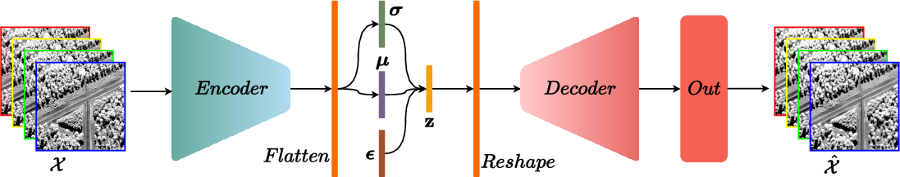
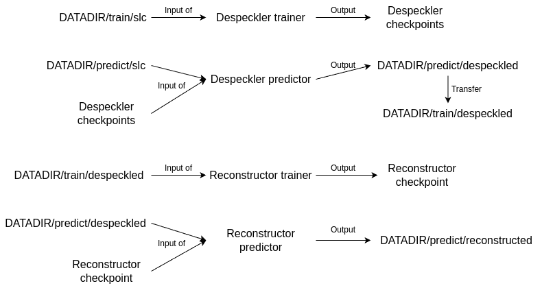

# Anomaly Detection in SAR imaging

## Abstract
In this paper, we propose an unsupervised learning approach for anomaly detection in SAR imaging. The proposed model combines a preprocessing despeckling step, a $\beta$-*annealing* Variational Auto-Encoder (VAE) for unsupervised anomaly filtering, and an anomaly detector based on the change of the covariance matrix at the input and output of the $\beta$-*annealing* VAE network. Experiments have been carried out on X-band ONERA polarimetric SAR images to demonstrate the effectiveness of Beta-Annealing VAE compared with the methods proposed in the literature.

## Architecture


## Getting started
Anomaly Detection in SAR imaging with Adversarial AutoEncoder, Variational AutoEncoder and Reed-Xiaoli Detector.
To begin, clone the repository with ssh or https:

```shell
git clone git@github.com:ouioui199/vae-for-sar-anomaly-detection.git
git clone https://github.com/ouioui199/vae-for-sar-anomaly-detection.git
```

### Environment
Create a virtual environment with miniconda or other tools.
Details to install miniconda could be found [here](https://www.anaconda.com/docs/getting-started/miniconda/install).

### Install requirements
```shell
pip install -r requirements.txt
```

Install torchcvnn latest developments and install it as a library
```shell
git clone --single-branch --branch dev_transforms https://github.com/ouioui199/torchcvnn.git
pip install -e torchcvnn
```

We will use Pytorch-Lightning to organize our code. Documentations can be found [here](https://lightning.ai/docs/pytorch/stable/starter/introduction.html)

## Data folder structure
For quad-polarization images, the data folder container MUST be organized like below. Create folders if needed. Fell free to rename ```data_folder1``` and ```data_folder2``` to best organize your dataset.
```
|- data_folder1/
|   |- L_band/
|   |- UHF_band/
|   |- X_band/
|   |   |- train/
|   |   |- predict/
|   |   |   |- despeckled/
|   |   |   |- reconstructed/
|   |   |   |- slc/
|   |   |   |   |- something_Hh_something.npy
|   |   |   |   |- something_Hv_something.npy
|   |   |   |   |- something_Vh_something.npy
|   |   |   |   |- something_Vv_something.npy
|- data_folder2/
|   |- L_band/
|   |   |- train/
|   |   |- predict/
|   |   |   |- despeckled/
|   |   |   |- reconstructed/
|   |   |   |- slc/
|   |   |   |   |- something_Hh_something.npy
|   |   |   |   |- something_Hv_something.npy
|   |   |   |   |- something_Vh_something.npy
|   |   |   |   |- something_Vv_something.npy
|   |- UHF_band/
etc.
```
HvVh polarization should be pre-computed from Hv and Vh, with HvVh = (Hv + Vh) / 2. Normalization values will be computed automatically during the data processing, you don't need to do anything.

## Data preparation
Let's say you wish to train with data stored in ```DATADIR=/your/data/folder/data_folder1```. The code will operate as below:



Anomaly map computed with the Reed-Xiaoli detector can be computed with the command below. Note that this code works with 4 polarization SAR images.
```python
python compute_RX.py --version 0 --data_band your-choice --datadir /your/data/folder/data_folder1 --rx_box_car_size your-choice --rx_exclusion_window_size your-choice
```

## Training
First, you need to train the despeckler. We use [MERLIN](https://ieeexplore.ieee.org/document/9617648) algorithms.
The code will outputs and save checkpoints to ```weights_storage/version_your-version-here/despeckler/checkpoints-name.ckpt```. Remember to rename 'your_version_here'. In the shell file has already been programmed to run sequentially 4 channels of a full polarization SAR image. If you wish to run it only on certain channel, comment the concerned code. Codes are run via a shell file. Set the parameters before runs.
```shell
bash train_despeckler.sh > train_despeckler_log.txt 2>&1
```
The despeckler training has now finished, you must compute predictions to get despeckled SAR images.
```shell
bash predict_despeckler.sh > pred_despeckler_log.txt 2>&1
```

Once having despeckled images, to train the reconstruction network (VAE, AAE), run
```shell
bash train_reconstructor.sh > train_recon_log.txt 2>&1
```
Finally, run
```bash
bash predict_despeckler.sh > pred_recon_log.txt 2>&1
```
to perform prediction. The code will perform reconstruction from a despeckled image, and also anomaly map computed with Frobenius norm. 

## Tensorboard
During training, it is possible to visualize running loss and metrics. To do so, run the command below in your terminal from the project directory:
```python
tensorboard --logdir=training_logs/version_your-choice
```

## Folder structure
Once start running the code, the project folder will be organized as below. After cloning the code, create environments, install dependencies and prepare the data folder, you can start immediately the training. No further actions are required. All folders will be created automatically.
```
|- images/
|- scripts/
|   |- datasets/
|   |- models/
|   |- predict_despeckler.py
|   |- predict_reconstructor.py
|   |- train_despeckler.py
|   |- train_reconstructor.py
|   |- utils.py
|- training_logs/
|   |- version X/
|   |   |- despeckler
|   |   |   |- visualization
|   |   |   |- validation_samples
|   |   |- reconstructor
|   |   |   |- visualization
|   |   |   |- validation_samples
|- weights_storage/
|   |- version X/
|   |   |- despeckler
|   |   |- reconstructor
|- .gitignore
|- compute_RX.py
|- predict_despeckler.sh
|- predict_reconstructor.sh
|- README.md
|- requirements.txt
|- train_despeckler.sh
|- train_reconstructor.sh
```
